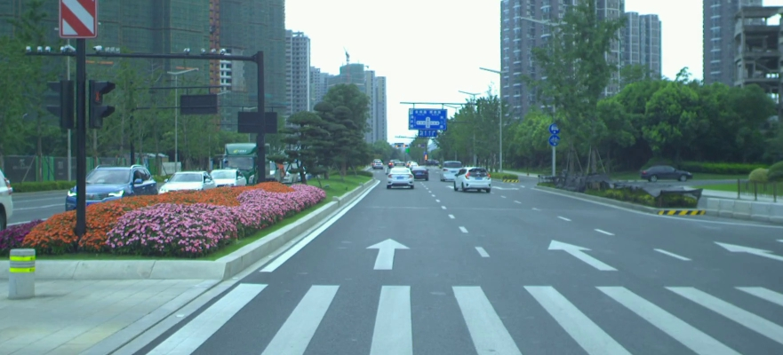
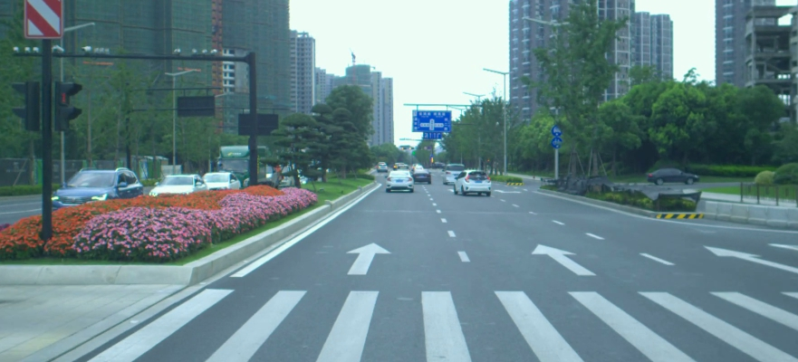
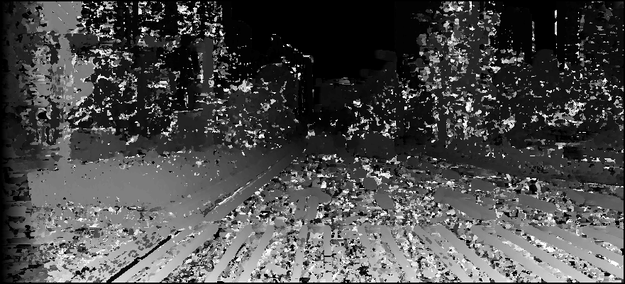
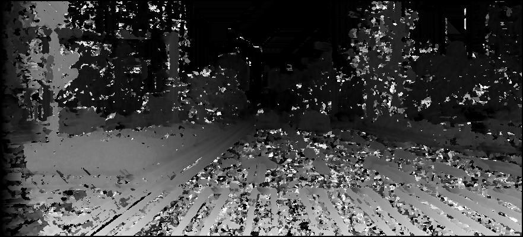

# Semi-Global-Matching

The primary objective of this project is to address the stereo disparity problem by integrating the Normalized Cross-Correlation (NCC) algorithm with the Semi-Global Matching (SGM) algorithm. In addition to this integration, this project focuses on optimising the performance of these algorithms. One aspect of optimisation involves re-formulating the NCC function for improved efficiency. Furthermore, I implement caching mechanisms to store reused data, thereby reducing computational overhead. For accelerating the SGM algorithm, I employ tensor operations in NumPy rather than conventional pixel-by-pixel iteration. This approach significantly enhances the computational efficiency of the algorithm.

## Results

<table>
    <thead>
        <tr>
            <th></th>
            <th text-align="center">Left Image</th>
            <th>Right Image</th>
        </tr>
    </thead>
    <tbody>
        <tr>
            <th>Original</th>
            <td rowspan=1, text-align="center">
                
            </td>
            <td rowspan=1>
                
            </td>
        </tr>
        <tr>
            <th>NCC Disparity</th> 
            <td colspan=2, align="center"></td>
        </tr>
        <tr>
            <th>SGM Disparity</th> 
            <td colspan=2, align="center"></td>
        </tr>
    </tbody>
</table>

## Runtime Improvement

|         | Standard NCC | Accelerated NCC |
| ------- | ------------ | --------------- |
| Runtime | 517.14 (s)   | 255.15 (s)      |

## Dependencies

The project uses `python==3.12.2`, and the dependencies can be installed by running:

```
pip install -r requirements.txt
```

The main code is in [final_project.ipynb](./final_project.ipynb)

## Credits

- Yu Hsien Chiang, Thomas Chen

## References

- [Stereo Processing by Semiglobal Matching and Mutual Information](https://ieeexplore.ieee.org/document/4359315)
- [Stereo Disparity Using Semi-Global Block Matching](https://www.mathworks.com/help/visionhdl/ug/stereoscopic-disparity.html)
- [Real-Time Semi-Global Matching Using CUDA Implementation
  ](https://web.stanford.edu/class/cs231a/prev_projects_2016/semi_global_cs231.pdf)
- [Template Matching using Fast Normalized Cross Correlation](https://isas.iar.kit.edu/pdf/SPIE01_BriechleHanebeck_CrossCorr.pdf)

